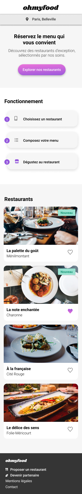

# Ohmyfood 🍴

 

Ohmyfood est une application web dédiée à ceux qui recherchent une expérience culinaire fluide et interactive. Réservez vos menus préférés dans les meilleurs restaurants en quelques clics grâce à notre interface conviviale et moderne.

## Démonstration en ligne

🌐 [Accéder à la démo](https://trackozor.github.io/p3/)

## Aperçu visuel

Cliquez sur les images pour voir en taille réelle.

[](images/Home-page-mobile.png)
[](images/Home-page-desk.png)

## Licence

Ce projet est sous licence [MIT](LICENSE).

## Fonctionnalités principales

### Page d'accueil

- **Cartes interactives** : Chaque restaurant est représenté par une carte dynamique qui s'anime au survol.
- **Appel à l'action clair** : Réservez facilement grâce à des boutons intuitifs.
- **Section explicative** : Découvrez comment utiliser Ohmyfood pour simplifier vos réservations.

### Pages spécifiques aux restaurants

- **Présentation des restaurants** : Image, description et emplacement.
- **Menus détaillés** : Visualisez les menus avec leurs descriptions et prix.
- **Réservations rapides** : Boutons dédiés pour réserver en un clic.

### Animations CSS

- **Chargement interactif** avec effets visuels.
- **Transitions fluides** pour améliorer l'expérience utilisateur.

### Accessibilité

- **Balises ARIA** pour les lecteurs d'écran.

## Prérequis

Pour configurer et exécuter ce projet localement, assurez-vous que les éléments suivants sont installés :

- **Node.js** (version 14 ou supérieure) : Nécessaire pour exécuter des scripts et compiler Sass.
- **npm (ou yarn)** : Gestionnaire de paquets pour installer les dépendances. npm est inclus avec Node.js.
- **Sass** : Préprocesseur CSS utilisé pour organiser et optimiser les styles.
- **Navigateur moderne** : Un navigateur comme Chrome ou Firefox pour tester le rendu du site.

## Technologies utilisées

- **HTML5** : Structuration des pages web.
- **CSS3 / SCSS** : Styles et animations avancées avec un préprocesseur Sass.
- **Node.js et npm** : Gestion des dépendances et compilation des fichiers SCSS en CSS.

## Installation rapide

Clonez le projet :

```sh
git clone https://github.com/username/ohmyfood.git
cd ohmyfood
```

Installez les dépendances :

```sh
npm install
```

Compilez les fichiers SCSS :

```sh
npm run sass
```

Ouvrez le fichier `index.html` :

- Utilisez votre navigateur ou un serveur local (comme VS Code Live Server).

## Installation pas à pas

1. **Téléchargez et installez Node.js** :
   - Rendez-vous sur [Node.js](https://nodejs.org).
   - Téléchargez la version LTS recommandée.
   - Installez Node.js en suivant les instructions pour votre système d'exploitation.
   - Vérifiez l'installation :

   ```sh
   node -v
   npm -v
   ```

2. **Initialisez votre projet Node.js** :
   - Ouvrez un terminal ou une invite de commandes, accédez au dossier de votre projet, puis exécutez :

   ```sh
   npm init -y
   ```

   Cela crée un fichier `package.json` qui contient les informations de base sur votre projet.

3. **Ajoutez Sass comme dépendance de développement** :
   - Installez Sass localement dans le projet :

   ```sh
   npm install sass --save-dev
   ```

   Cette commande ajoute Sass à la section `devDependencies` de votre fichier `package.json`.

4. **Ajoutez un script pour compiler Sass** :
   - Modifiez votre fichier `package.json` pour inclure ce script dans la section `scripts` :

   ```json
   "scripts": {
       "sass": "sass --watch scss:css"
   }
   ```

   Cela configure un script qui surveille les fichiers SCSS dans le dossier `scss` et les compile en CSS dans le dossier `css`.

5. **Compilez les fichiers SCSS** :
   - Pour compiler et suivre les évolutions en temps réel, exécutez :

   ```sh
   npm run sass
   ```

## Contributions

Les contributions sont les bienvenues ! Veuillez suivre ces étapes :

1. Forkez le projet.
2. Créez une branche pour votre fonctionnalité (`git checkout -b feature/new-feature`).
3. Commitez vos modifications (`git commit -m 'Ajout d'une nouvelle fonctionnalité'`).
4. Poussez sur votre branche (`git push origin feature/new-feature`).
5. Créez une Pull Request.

## Structure des fichiers

Le projet est organisé de manière modulaire pour faciliter la maintenance et l'évolution :

```sh

ohmyfood/
├── .vscode/                # Configuration pour Visual Studio Code (facultatif)
│
├── css/
│   └── main.css            # Fichier CSS compilé depuis SCSS
│
├── images/
│   ├── logo/               # Images du logo
│   └── restaurants/        # Images des restaurants
│
├── pages/
│   ├── délice.html         # Page dédiée au restaurant "Le Délice des Sens"
│   ├── la_française.html   # Page dédiée au restaurant "À La Française"
│   ├── note_enchantée.html # Page dédiée au restaurant "La Note Enchantée"
│   └── palette.html        # Page dédiée au restaurant "La Palette du Goût"
│
├── scss/                   # Fichiers SCSS pour les styles
│   ├── components/         # Boutons, cartes, etc.
│   │   ├── _button.scss   
│   │   ├── _card.scss
│   ├── layout/             # Header, footer, structures principales
│   │   ├── _common.css     
│   │   ├── _footer.scss
│   │   ├── _header.scss
│   │   ├── _loader.scss
│   │   ├── _reset.scss
│   ├── pages/              # Styles spécifiques pour chaque page
│   │   ├── _accueil.scss
│   │   ├── _menu.scss
│   ├── util/               # Variables, mixins, animations
│   │   ├── _variables.scss # Couleurs, typographie, etc.
│   │   ├── _mixins.scss    # Media queries, styles réutilisables
│   │   └── _animations.scss # Animations CSS
│   └── main.scss           # Point d'entrée SCSS
│
├── index.html              # Page principale
│
├── package.json            # Configuration pour npm
│
└── README.md               # Documentation du projet
```
